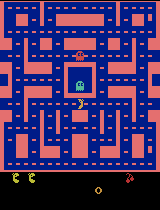
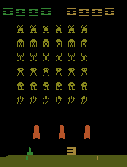
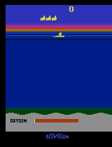
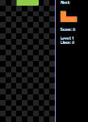

# Manette : Deep Reinforcement Learning for Atari Games
This repository contains an open source implementation of the PAAC algorithm presented in [Efficient Parallel Methods for Deep Reinforcement Learning](https://arxiv.org/abs/1705.04862) and forked from [Alfredvc's implementation](https://github.com/Alfredvc/paac). We added the possibility to use the FiGAR algorithm presented in [Fine Grained Action Repetition for Deep Reinforcement Learning](https://arxiv.org/abs/1702.06054) as well as LSTM networks, Bayesian networks, e-greedy policy and playing with colored images.

PAAC is a conceptually simple advantage actor-critic algorithm designed to run efficiently on a GPU, offering A3C like performance in under 12 hours of training. When adding FiGAR, the agent can explore more possibilities and achieve higher scores with a better motion control.







This experimental branch contains other games that you can play with. Feel free to add yours and have fun !





# Requirements
* Python 3.4+
* TensorFlow 1.0+
* [Arcade-Learning-Environment](https://github.com/mgbellemare/Arcade-Learning-Environment)
* cython (pip3 package)
* scikit-image (pip3 package)
* python3-tk
* [Open AI Gym](https://github.com/openai/gym)

# Training the agent
To train an agent to play Pong, for example, run : ```python3 train.py -g pong -df logs/test_pong```.

Training can be stopped (using Ctrl+c) and then resumed by running ```python3 train.py -g pong -df logs/test_pong```.

## Training with other games
Just change the name of the game that you want to play, with the ```-g``` option.

Currently these games are available :
* All the Atari games
* Some Open AI Gym games : FlappyBird-v0, CartPole-v0, MountainCar-v0, Catcher-v0, MonsterKong-v0, RaycastMaze-v0, Snake-v0 .
* Tetris ! You can even play the game yourself by running ```python3 tetris.py```.

## Visualizing training
1. Open a new terminal
2. Run ```tensorboard --logdir=<absolute-path>/manette/logs```.
3. In your browser navigate to localhost:6006/

Many graphs are already available (rewards per episode, length of episode, steps per second, loss, ...) and you can easily add yours.

# Testing the agent
To test the performance of a trained agent run ```python3 test.py -f logs/test_pong -tc 5```.

## Generating gifs
Gifs can be generated from stored network weights. For example a gif of the agent playing breakout can be generated with
```
python3 test.py -f pretrained/breakout/ -gn breakout
```
This may take a few minutes.

# Training options

The most useful options for the training are :
* ```-g``` : Name of the Atari 2600 game you want to play. All the games in ```atari_roms``` are available.
* ```-df``` : Destination folder, where the information is saved for each game (checkpoints, tensorboard graphs, ...)
* ```-lr``` : Initial value for the learning rate. Default = 0.224.
* ```-lra``` : Number of global steps during which the learning rate will be linearly annealed towards zero.
* ```--entropy``` : Strength of the entropy regularization term. Default = 0.02. Should be increased when using FiGAR.
* ```--max_global_steps``` : Maximum number of training steps. 80 million steps are enough for most games.
* ```--max_local_steps``` : Number of steps to gain experience from before every update. 5 is good.
* ```--arch``` : Which network architecture to use : NIPS, NATURE, PWYX, BAYESIAN. See below for descriptions.
* ```-ec``` : Emulator counts. Number of emulator playing simultaneously. Default = 32.
* ```-ew``` : Emulator workers. Number of threads that computes the emulators' steps. Default = 8 : each thread computes for 4 emulators.
* ```--egreedy``` : Whether to use an e-greedy policy to choose the actions or not.
* ```--epsilon``` : If using an e-greedy policy, the epsilon coefficient. Default = 0.05 .
* ```--softmax_temp``` : Softmax temperature for the Boltzmann action choice policy. Default = 1.
* ```--annealed``` :  Whether to anneal the epsilon towards zero or not for e-greedy policy.
* ```--annealed_steps``` : Number of global steps before epsilon is annealed.
* ```--keep_percentage``` : When the Bayesian/Dropout network is used, keep percentage. Default = 0.9 .
* ```--rgb``` : Whether to use RGB images for the training or not.
* ```--checkpoint_interval``` : Interval of steps btw checkpoints
* ```--activation``` : Activation function for the network : ```relu``` or ```leaky_relu```.
* ```--alpha_leaky_relu``` : Coefficient when using leaky relu.

**To use FiGAR**, the options are ```--max_repetition``` and ```--nb_choices```. ```max_repetition``` is the maximum number of times that an action can be repeated. ```nb_choices``` is the number of choices that the agent has, equally distributed from 0 to max. If put to (0, 1), there is no repetition, you are not using FiGAR (i.e. the possible repetitions are [0]). If put to (10, 11), the possible repetitions are [0,1,2,3,4,5,6,7,8,9,10]. If put to (10, 6), the possible repetitions are [0,2,4,6,8,10]

## BatchTrain script

If you are tired of typing multiple options in the command line to use the ```train.py``` file, you can use the ```batchTrain.py``` script in the ```script``` folder.
Simply write as many JSON files (like the one below) as you want, change all the options you wish and put them all in the same folder, say ```toTrain/experiment1/```.

Run : ```python3 script/batchTrain -f toTrain/ -d logs/ ```.

All your JSON files will be loaded and trained, one after the other, with the right options, and saved in ```logs/DATE-experiment1/```.

Exemple of JSON file for Pong, with PWYX network and FiGAR 10 repetitions :
```
{
  "game": "pong",
  "initial_lr": 0.0224,
  "lr_annealing_steps": 80000000,
  "max_global_steps": 80000000,
  "max_local_steps": 5,
  "gamma": 0.99,
  "alpha": 0.99,
  "entropy_regularisation_strength": 0.02,
  "arch": "PWYX",
  "emulator_workers": 8,
  "emulator_counts": 32,
  "clip_norm_type": "global",
  "clip_norm": 3.0,
  "single_life_episodes": false,
  "e": 0.1,
  "random_start": true,
  "egreedy": false,
  "epsilon": 0.05,
  "softmax_temp": 1.0,
  "annealed": false,
  "annealed_steps": 80000000,
  "keep_percentage": 0.9,
  "rgb": false,
  "max_repetition": 10,
  "nb_choices": 11,
  "checkpoint_interval": 1000000,
  "activation": "relu",
  "alpha_leaky_relu": 0.1
}
```

## Other scripts

Some other scripts can also simplify your life (ex. test all the agents, create many gifs, ...).
You can find them in the ```script``` folder. The ```script/README.md``` contains explanations on how to use them.


## Adapting to new neural network architectures
The codebase currently contains five neural network architectures :
* NIPS : the architecture used in [Playing Atari with Deep Reinforcement Learning](https://arxiv.org/abs/1312.5602).
* NATURE : the architecture from [Human-level control through deep reinforcement learning](https://www.nature.com/nature/journal/v518/n7540/full/nature14236.html).
* BAYESIAN : the NIPS network with a dropout layer to improve the exploration policy. See this paper about [Dropout as a Bayesian Approximation](https://arxiv.org/abs/1506.02142).
* PWYX : a bigger convolutionnal network with max pooling, inspired by [ppwwyyxx's work](https://github.com/ppwwyyxx/tensorpack/tree/master/examples/A3C-Gym).

To create a new architecture follow the pattern demonstrated in the other networks.
Then create a new class that inherits from both the ```PolicyVNetwork``` and```YourNetwork```. For example:  ```NewArchitecturePolicyVNetwork(PolicyVNetwork, YourNetwork)```. Then use this class in ```train.py```.

## Other games

## Advice
* **When using FIGAR**, it is better to choose a bigger network like PWYX.
* The **entropy regularization strength** (ERS) is an important parameter. It should stay between 0.01 and 0.1 .  If you notice that your agent's score is stuck and can't improve, try increasing the ERS. On the contrary, if the score seams unstable (often falling down to zero without reason) or the standard deviation of the score is high, try decreasing the ERS. As an example, for PAAC default, I use ERS=0.02, and for FiGAR 10 , ERS = 0.05.
